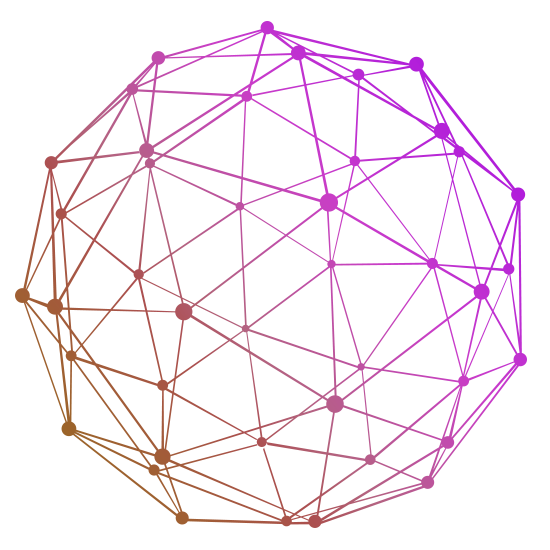

# 🤿 Подготовка к интервью на DevOps-а

## Плюс база для всех it-ишников

## Для кого?

<table>
  <tr>
    <td><a href="#">&nbsp;<b>DevOps</b></td>
  </tr>
  <tr>
    <td><a href="#">&nbsp;<b>Разработчики</b></td>
  </tr>
  <tr>
    <td align="center"><a href="#">&nbsp;<b>Вайб-кодеры</b></td>
  </tr>
</table>

*****

  <table>
    <tr>
      <td align="center" valign="bottom"><a href="topics/hardware/README.md"> <b>Железо</b></a></td>
      <td align="center" valign="bottom"><a href="topics/git/README.md"> <b>Сети</b></a></td>
      <td align="center" valign="bottom"><a href="#network"> <b>Git</b></a></td>
      <td align="center" valign="bottom"><a href="#hardware"> <b>linux</b></a></td>
      <!-- <td align="center"><a href="topics/kubernetes/README.md"> <b>Kubernetes</b></a></td> -->
    </tr>
  </table>

