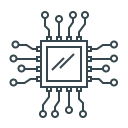

 <b>Железо</b>

### Что такое бит?

### Двоичная система счисления

## Бит

(bit - <b>bi</b>nary digi<b>t</b> - двоичная цифра, также игра слов: анг bit - кусочек, частица) - единица измерения количества информации.

  
[Игра слов]

«Игра слов» — это когда одно и то же слово одновременно:
1. имеет техническое значение (здесь — единица информации),
2. и обыденное, «бытовое» значение (кусочек, частица).
В нашем случае:
- «bit» = binary digit (двоичная цифра, 0 или 1) — технический термин.
- «bit» = «кусочек» или «частица» в обычном английском.

 

1 бит информации - символ или сигнал, который может приниматься два значения:
- включено или выключено;
- да или нет;
- в двоичной системе счисления это 1(единица) или 0(ноль)

1 бит это минимальное количество информации, которое необходимо для описания один из двух вариантов.

- 1 бит = 0 или 1
- 1 байт - это 8 бит

Биты используются в скорости сети и передаче данных, например, в kbit/s, Mbit/s

Байт для обозначения размера памяти или файлов:
- 1 Кбайт(килобайт) = 1024 байт
- 1 Мбайт(мегабайт) = 1024 Кбайт
- 1 Гбайт(гигабайт) = 1024 Мбайт
- 1 Тбайт(терабайт) = 1024 Гбайта

Вопрос:
Теперь по аналогии вы сможете ответить: Что такое байт, пока только на основе этой информации

### Что такое 1 байт?

Байт (byte) единица хранения и обработки цифровой информации; совокупность би́тов, обрабатываемых компьютером одновременно.

  
[Почему хранения?]

Выше сказали, что байты для обозначения размера памяти или файлов.

 

В современных вычислительных системах байт состоит из 8 бит и, соответственно, может принимать одно из 256 (от 0 до 255) различных значений (состояний, кодов). Однако в истории компьютерной техники существовали решения с иными размерами байта (например, 6, 32 или 36 бит), поэтому иногда в компьютерных стандартах и официальных документах для однозначного обозначения группы из 8 бит используется термин «октет»

В большинстве вычислительных архитектур байт — это минимальный независимо адресуемый набор данных.

## Двоичная система счисления

...В процессе ...

Источник:
1. [Источник 1](https://l.threads.com/?u=https%3A%2F%2Fru.wikipedia.org%2Fwiki%2F%25D0%2591%25D0%25B8%25D1%2582&e=AT4fM_spjBuDAtXsoeZxj_tq2sJKcF1dcia1sThwgUAXEmK7Tt9PC2Bch9nDH2-rjCoOr1vxplXB14uM1-FHvQHWWj_Og-iEgePWwoQjV3dIbeo4WEdl4bTk4n2YvdLmDws1DGg)